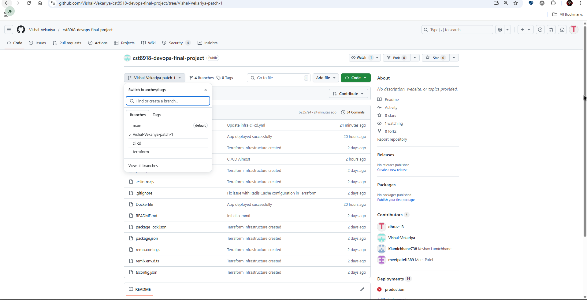
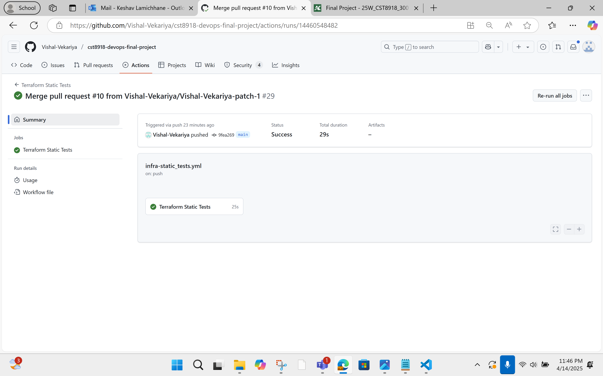
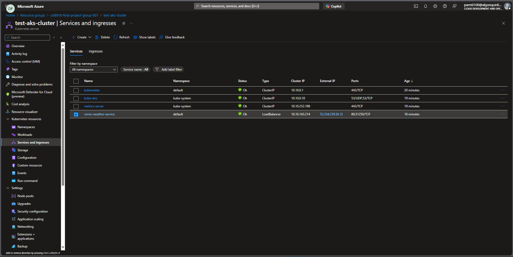
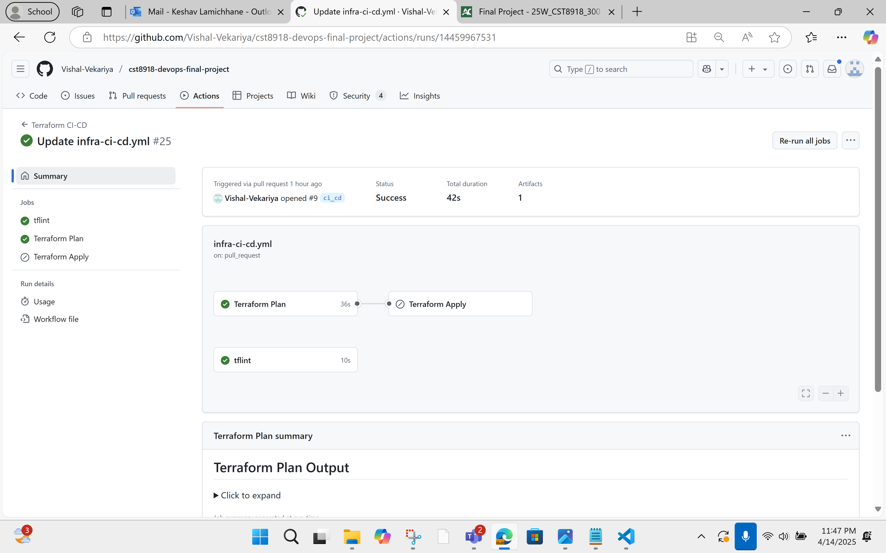
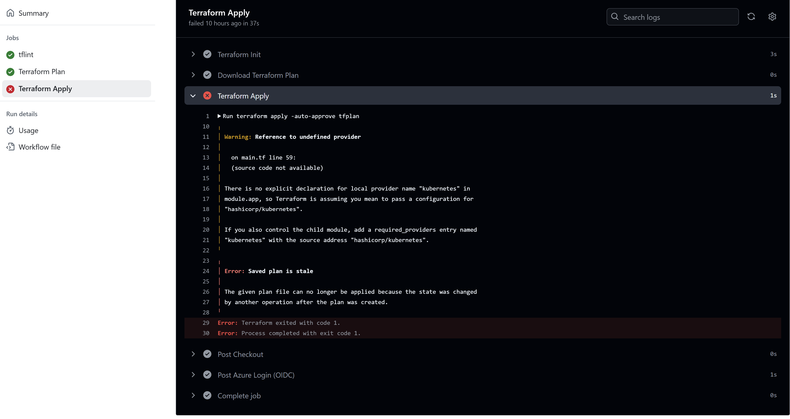

# ☁️ CST8918 – DevOps Final Project: Remix Weather Application

This repository showcases our final project for the course **DevOps: Infrastructure as Code (CST8918)**. The goal was to automate the provisioning and deployment of a Remix-based weather application using **Terraform**, **Azure AKS**, and **GitHub Actions**.

We structured our project using Infrastructure as Code (IaC) principles and designed CI/CD pipelines for static tests, build, and deployment.

---

## 👥 Team Members

- [Keshav Lamichhane](https://github.com/Klamichhane738)
- [Vishal Vekariya](https://github.com/Vishal-Vekariya)
- [Meet Jitendrakumar Patel](https://github.com/meetpatel1389)
- [Dhruv Parmar ](https://github.com/dhruv-13)
---


## 📁 Project Structure

```bash
CST8918-DEVOPS-FINAL-PROJECT/
├── .github/
│   └── workflows/
│       ├── infra-ci-cd.yml            # GitHub Actions: Infra & App Deployment
│       └── infra-static_tests.yml     # GitHub Actions: Static Code Checks
├── app/                               # Remix Weather App Source Code
│   ├── api-services/
│   ├── data-access/
│   ├── routes/
│   ├── utils/
│   ├── entry.client.tsx
│   ├── entry.server.tsx
│   └── root.tsx
├── build/                             # Build output
├── infrastructure/                    # Terraform IaC (AKS, ACR, Networking, etc.)
├── public/                            # Static files
├── .eslintrc.cjs
├── .gitignore
├── Dockerfile                         # Docker setup for Remix App
├── package.json
├── package-lock.json
├── remix.config.js
├── remix.env.d.ts
├── tsconfig.json
└── README.md
```

## All provisioning and deployment steps are automated through GitHub Actions. Simply push changes or open a Pull Request and the workflows will execute accordingly.

### Branches of main project with project structure


### 🔍 Static Tests & Terraform Validation

On **every push or pull request** to any branch, the `infra-static_tests.yml` workflow will:

- Run ESLint for the Remix app  
- Run `terraform fmt`, `terraform validate`, and `terraform plan` for infrastructure code  

✅ This ensures all code and infrastructure follow best practices before merging.



### 🚀 CI/CD Pipeline

On **push to `main`** branch, the `infra-ci-cd.yml` workflow will:

1. **Initialize Terraform**
2. **Apply Infrastructure** (AKS, ACR, Redis, etc.)
3. **Build the Remix Docker image**
4. **Push Docker image to Azure Container Registry (ACR)**
5. **Deploy updated image to Azure Kubernetes Service (AKS)**

> All steps are automated — no need to run `terraform` or `docker` manually.

### 🧪 Defined Resources

- **Terraform Backend:** Configured using Azure Blob Storage
- **Virtual Network (10.0.0.0/14):**
  - `prod`: 10.0.0.0/16
  - `test`: 10.1.0.0/16
  - `dev`: 10.2.0.0/16
  - `admin`: 10.3.0.0/16
- **AKS Clusters:**
  - `test`: 1 node, Standard B2s, Kubernetes v1.32
  - `prod`: 1–3 nodes, Standard B2s, Kubernetes v1.32
- **Redis Cache:** One instance in each `test` and `prod`
- **Remix App:** Dockerized and deployed to AKS via Kubernetes manifests

---

### 🔐 Azure Federation

Azure federated credentials were configured using Azure AD to securely authenticate GitHub Actions workflows, eliminating the need for storing secrets.

---

### ✅ Branching & Collaboration

- Each feature or bug fix was developed in a separate branch.
- Pull Requests (PRs) were opened for each branch to `main`
- PRs require:
  - At least 1 approving review
  - Status checks (CI workflows) to pass
  - No direct push to `main`
- All collaborators made contributions via PRs

### Remix Weather Application Screenshot


### Remix weather-service in AKS Cluster



### Below is a screenshot of the successful GitHub Actions runs for CI/CD:



---

### 🐛 Known Issue Faced During Deployment

While deploying the infrastructure using Terraform via GitHub Actions, we encountered the following error:

> **Error: Saved plan file is stale**  
> The given plan file can no longer be applied because the state was changed after the plan was created.

This typically happens when there is a delay between the `terraform plan` and `terraform apply` steps, or if another deployment alters the state in between.

### 🔧 Resolution
- We tried to resolve this by re-running `terraform plan` to generate a fresh plan file and applying it immediately but it didnt work out.
- To avoid this in future, combining the plan and apply steps or using artifact uploads/downloads with approvals in a short time frame is recommended.

### 📸 Screenshot of the Error:



---
---

## 🎓 Lessons Learned

This capstone project provided us with hands-on experience in applying DevOps principles using real-world tools and cloud services. Key takeaways from the project include:

### 🔧 Infrastructure as Code (IaC)
- Learned to design modular and reusable Terraform code for complex cloud architectures.
- Understood how to configure and manage remote backends using Azure Blob Storage.
- Gained insight into managing multiple environments (dev, test, prod) using subnet segregation and naming conventions.

### ⚙️ CI/CD Automation with GitHub Actions
- Developed automated workflows for testing, provisioning, and deploying infrastructure and application code.
- Learned how to trigger jobs conditionally (e.g., only on application changes or infrastructure changes).
- Understood the importance of branch protection rules and peer-reviewed pull requests in a collaborative environment.

### ☁️ Azure Services Integration
- Integrated multiple Azure services including Azure Kubernetes Service (AKS), Azure Container Registry (ACR), Azure Blob Storage, and Azure Cache for Redis.
- Deployed a containerized Remix Weather Application to Kubernetes and configured persistent services.
- Set up federated credentials for secure authentication between GitHub Actions and Azure, removing the need for static secrets.

### 🧠 Problem Solving & Troubleshooting
- Faced and resolved real-world issues like stale Terraform plans, cluster versioning mismatches, image pull errors, and deployment rollout delays.
- Learned how to debug CI/CD pipeline failures and interpret Terraform logs effectively.

### 🤝 Team Collaboration
- Adopted Git branching strategies to isolate and manage work efficiently.
- Practiced pull request workflows, peer code reviews, and collaborative issue tracking.
- Understood the importance of communication and division of responsibilities in multi-member teams.

---

Overall, this project significantly strengthened our understanding of cloud infrastructure management, DevOps automation, and collaborative software development in a production-grade environment.

---
